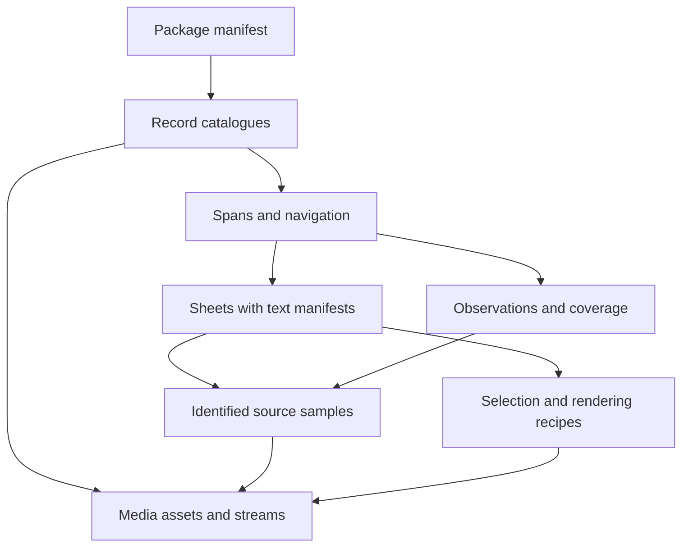

# ROAMV Video Format Design

**Informative research, not the wire specification.** The standalone
[ROAMV sealed core](../spec/roamv/FORMAT.md) and its
[schema](../spec/roamv/manifest.schema.json) now define `0.1.0-draft.1`.
That core uses inline record maps, `annotations` and `processes`, and one
package-relative time axis with native time maps. The catalogue layouts,
`observations`, `runs`, and multiple-clock sketches below are earlier design
options, not alternative valid encodings of this draft. Engine adapters are
optional integrations, never a prerequisite.

ROAMV is a proposed video package with three connected parts: preserved media,
addressable samples and observations, and compact visual summaries. Its central
operation is to show change as a spatial arrangement, then let the reader resolve
any part of that arrangement back to a source frame or interval.

The recommended first implementation is a directory of ordinary media, JSON
records, and `opsis` images with accompanying text. Compression and playback use
existing media formats. ROAMV specifies the relationships, timing, selection,
qualifications, and retrieval behavior around them.

This is a design draft, not an implemented or registered standard. Proposed wire
versions should begin at `0.1.0-draft.1`; `ROAMV/1` should be reserved for a tested
interoperability contract. The [implementation plan](ROAMV-PLAN.md) defines that
path. Existing `ROAM/1 opsis` files retain their existing meaning.

## Research Basis

The image-grid idea has relevant prior evidence. IG-VLM arranged video frames
into a single image and evaluated video question answering. Its ablations favored
compact grids over long strips, found ordering mattered, and favored six frames
in the two reported frame-count experiments. It also documented losses from
resizing and cropping during model preprocessing. These results justify testing
grids; they do not establish four tiles, a particular resolution, or travel
sampling as universally optimal. [IG-VLM, sections 5-6](https://arxiv.org/html/2403.18406v1#S5)[^1]

Modern readers can also accept video. Google's documentation describes video and
audio input, adjustable sampling, and token usage that depends on processing and
resolution. The repository's fixed token estimates and assertion that a model
cannot watch should therefore be treated as historical motivation, not format
requirements. A useful ROAMV reader must be able to choose a sheet, individual
images, or a source clip. [Gemini video documentation](https://ai.google.dev/gemini-api/docs/video-understanding)[^2]

TemporalBench evaluates distinctions such as repetition, event order, and motion
magnitude. Those are better tests of this format than whether a model recognizes
the objects in its tiles. Video-MME-v2 extends the concern to consistency across
related questions and multimodal reasoning; its 2026 results remain evidence
about its tested systems, not a forecast of ROAMV performance.
[TemporalBench](https://arxiv.org/abs/2410.10818)[^3],
[Video-MME-v2](https://arxiv.org/abs/2604.05015)[^4]

The following allocation of responsibilities is a design recommendation based on
the capabilities documented by the projects and standards below.

| Existing Work | Relevant Capability | Proposed Use in ROAMV |
| --- | --- | --- |
| [FFmpeg and ffprobe](https://ffmpeg.org/ffprobe.html)[^5] | Media probing, decoding, stream and frame metadata | External media adapter; actual decoded samples determine frame references |
| [Matroska](https://www.matroska.org/technical/diagram.html)[^6] | Media tracks, seeking indexes, and attachments | Supported source container; evaluate embedded distribution after the directory format works |
| [OpenTimelineIO](https://opentimelineio.readthedocs.io/en/latest/tutorials/otio-timeline-structure.html)[^7] | Clips, source ranges, tracks, gaps, and transitions | Editorial import/export adapter with an explicit account of unsupported metadata |
| [MCAP](https://mcap.dev/spec)[^8] | Timestamped channels, message indexes, and recording versus publication times | Optional capture or telemetry backing store for high-rate poses and events |
| [Media Fragments](https://www.w3.org/TR/media-frags/)[^9] | Temporal intervals and rectangular spatial selection | Human-facing time and region links; preserve richer exact source identity internally |
| [Web Annotation](https://www.w3.org/TR/annotation-model/#fragment-selector)[^10] | Annotations attached to selected parts of resources | Export of observations and their targets |
| [WebVTT](https://www.w3.org/TR/webvtt1/)[^11] | Timed text, captions, descriptions, and chapters | Caption import/export; preserve original timing in JSON when export rounds it |
| [BagIt](https://www.rfc-editor.org/rfc/rfc8493)[^12] | File packaging with payload checksums | Optional archival wrapper around a sealed package |
| [C2PA 2.2](https://spec.c2pa.org/specifications/specifications/2.2/specs/C2PA_Specification.html)[^13] | Assertions about assets, transformations, and provenance | Preserve existing credentials; consider an exporter if signed provenance is needed |

None of these integrations should be required merely to inspect a PNG and its
manifest. Exporting to another format must return a loss report when ROAMV fields
have no equivalent representation. No compatibility claim follows from using
similar field names.

## Design Corrections

The useful invariant is that pixels carry visual evidence while structured text
carries explicit identities and qualifications. This does not mean a model cannot
read text in an image, or that it will interpret a textual number correctly every
time. Deterministic readers and validators enforce exact relationships. Source
text, such as a sign or an existing subtitle, remains part of the source image.

Several stronger claims need narrower definitions:

| Earlier Assumption | Proposed Contract |
| --- | --- |
| Sample by travel | Use travel when reliable observer poses and the task make it relevant; retain time and event coverage independently |
| A stationary span contains no change | Camera translation, camera rotation, object activity, screen changes, and audio are independent signals |
| Frames are unaltered | Frames are source-derived through a declared decoding and rendering pipeline; resizing and JPEG encoding are transformations |
| Four tiles describe a span | Four tiles are a bounded preview; difficult spans can require more sheets, full frames, or a clip |
| Adjacent tiles show adjacent moments | Tiles have explicit timestamps; an ordered layout does not imply equal intervals or continuous observation |
| Hashes establish truth | Hashes establish byte identity relative to an expected digest; capture authenticity and annotation correctness are separate questions |
| A hierarchy is a summary image of summary images | Navigation references source samples; every rendered overview is built from source samples rather than resized sheets |

The format must preserve a way to say "insufficient evidence." A failed decode,
an unavailable pose, and no detected movement are different states.

## Logical Model

Keep the existing vocabulary as explanatory names, with ordinary names in the
wire format. A `sample` corresponds to a stigme, a `span` to a kairos, and a
`sheet` to an opsis. Kinesis can describe the complete package without becoming
another required schema layer.

| Record | Meaning | Required Relationships |
| --- | --- | --- |
| Asset | A source or derived file with identity, availability, and media type | Byte length and SHA-256 for materialized files; origin for sources; parents and recipe for derivatives |
| Stream | One video, audio, image-sequence, or data stream | Asset, stream locator, native clock, media properties |
| Sample | An identified observation of a stream | Source locator, time quality, and optional materialized still |
| Span | An interval, with a declared purpose | Clock, half-open bounds, source or stream membership |
| Sheet | A visual arrangement of samples | Ordered sample references, exact tile rectangles, rendering recipe, selection record, text manifest |
| Observation | A measurement, annotation, transcript cue, or proposed event | Evidence targets, producer, method, and qualification |
| Coverage | What was available, analyzed, selected, or missing | Scope, intervals or sample references, and reasons |
| Run | How derived records were produced | Tool versions, configuration, parent inputs, and output identities |



Navigation can look like video, chapter, shot, event, sample, source clip. It is
not a mandatory sequence of levels. Speech can cross a shot boundary; two events
can overlap; one frame can serve several views. Navigation membership must be
acyclic, while explicit cross-references express those overlaps. A temporal child
must be within its parent's interval; unrelated or overlapping intervals use a
cross-reference instead.

A shot is a proposed region of visual continuity. An event is an observation
about something happening. A scene or chapter is an editorial grouping. These
must have distinct record types or roles, since detecting a visual transition
does not determine an event's meaning.

## Package and Profiles

The directory layout below is proposed. Only files declared by the manifest are
part of a sealed package; empty optional directories are unnecessary.

```text
recording.roamv/
  manifest.json
  manifest.txt
  records/
    assets-0000.jsonl
    streams-0000.jsonl
    samples-0000.jsonl
    spans-0000.jsonl
    sheets-0000.jsonl
    coverage-0000.jsonl
    runs-0000.jsonl
    observations-0000.jsonl       optional
  media/
    original.mkv                original filename/type may differ
    preview.mp4                 optional derivative
  images/
    sample-0007.png
    sheet-0002.png
  text/
    sheet-0002.txt
    captions.en.vtt              optional export
  tracks/
    telemetry.mcap              optional extension
```

The root manifest declares the format version, package and revision identifiers,
source policy, required features, clocks, record catalogue descriptors, and
entrypoints. Each catalogue descriptor includes its record type, path, byte
length, digest, and record count. Multiple descriptors permit sharding without
changing record meaning. A reader may build a SQLite index locally, but the
database is a disposable accelerator rather than an additional authority.

JSON and JSONL use UTF-8. Each JSONL line contains one complete object. Readers
reject duplicate object keys and non-finite numbers; IDs are nonempty,
case-sensitive strings and unique across their declared record type. Foreign
references identify both the type and ID through their field definition. Schemas
must distinguish absent, unknown, and unavailable values explicitly; none implies
zero. Catalogues list their ordering, and consumers do not infer temporal order
from filenames or row order alone.

An `embedded` source policy includes every source asset referenced by the
package. A `linked` policy may omit source bytes while preserving their known
identities and an explicit availability state. A linked package can be valid
metadata while source verification remains unavailable. A URI alone does not
establish source identity. The first writer should support embedded sources;
link resolution can follow once digest checking is implemented.

Capture kind is a separate property: `continuous`, `sparse`, or `synthetic`.
Deliberate Unity marks are sparse acquisition even if the marks are combined into
a slideshow. The resulting slideshow is a derivative and does not establish what
happened between captures. Engine-rendered sources declare that origin even when
their capture is continuous.

Feature declarations extend the core for stereo, camera pose, spatial audio,
360-degree projection, dense tracks, or live capture. Unknown required features
make a reader report `unsupported`; unknown optional extensions may be preserved
without interpretation. An extension must not silently change core time, source,
or tile semantics. No new registered MIME type is assumed by this draft.

For distribution, first archive the directory using existing tooling. A ZIP
download is a transport option, not the streaming design. For storage or HTTP
access, expose the small manifest and immutable assets independently. An archival
export may wrap the directory in BagIt; it must implement BagIt's actual layout
and checksum rules before claiming conformance.

| Packaging Alternative | Assessment |
| --- | --- |
| Directory plus existing archive tooling | Recommended first: records and assets can be inspected and cached independently; sealing provides a defined completion boundary |
| Metadata embedded in Matroska or MP4 | Useful future single-file delivery; requires container-aware access and a tested embedding specification |
| OTIO as the primary document | Strong for editorial structure; ROAMV's source identity, coverage, and reader delivery would still need an additional contract |
| MCAP as the primary document | Strong for recorded channels and high-rate telemetry; generic media inspection would need additional adapters |

These are implementation tradeoffs, not claims that the alternatives cannot carry
the data. The directory model makes the first contract independently inspectable.

## Time and Source Identity

Use presentation time for display order. Keep native timestamps and their time
base; do not reconstruct time by dividing a frame number by an average frame
rate. Packet timestamps, decode ordering, capture time, and simulation time have
different meanings.

FFmpeg documents that seeking can land at an earlier seek point, and that accurate
transcoding seeks decode and discard the intervening material. ffprobe also warns
that interval seeks are not exact. Accordingly, a requested seek position is a
request, not the identity of the returned frame.
[FFmpeg seeking](https://ffmpeg.org/ffmpeg.html#Main-options)[^14],
[ffprobe interval reads](https://ffmpeg.org/ffprobe.html#Main-options)[^5]

Proposed exact-time representation:

```json
{
  "clock_id": "media-0",
  "seconds": {"n": "1001", "d": "30000"}
}
```

Rational numerators and denominators use canonical decimal integer strings, with
a positive denominator and fractions reduced to lowest terms. Zero is `0/1`.
Native PTS values and potentially large counters also use decimal strings. Small
bounded dimensions and tile indexes can remain JSON numbers. This avoids relying
on readers agreeing on integers beyond the broadly interoperable JSON range.
[RFC 8259, section 6](https://www.rfc-editor.org/rfc/rfc8259#section-6)[^15]

The following are proposed requirements:

1. Every timestamp names a clock. Package time is relative to a declared origin;
   optional UTC anchors do not determine frame ordering.
2. Every interval is half-open, `[start, end)`, with `end > start`. Point events
   have a separate point representation. This follows the interval convention
   used by [Media Fragments](https://www.w3.org/TR/media-frags/#naming-time)[^9].
3. Source PTS can be negative, duplicated, discontinuous, or absent. Missing PTS
   remains `null`; a synthesized timestamp carries its derivation and quality.
4. A frame locator includes the source asset, stream, discontinuity epoch, and
   presentation ordinal within that epoch. PTS and its occurrence number add
   seekable checks when available. The run identifies the indexing decoder.
5. A stream locator records the container track identifier when available and the
   demuxer's stream index and version. An unexplained stream ordinal is not
   portable identity across remuxes.
6. Frame duration is recorded when known, with its basis. The next frame's PTS
   can provide a derived duration within a continuous epoch; an unknown last
   duration must not be silently copied from a nominal frame rate.
7. Clock mappings are explicit piecewise rational affine transforms, with their
   valid intervals, measurement basis, and uncertainty. Reboots and resets begin
   new epochs. Unmeasured uncertainty is unknown, not zero.
8. Edits, speed changes, reverse playback, and freeze frames belong to an
   editorial mapping extension. They are not disguised as clock calibration.

When package time cannot be established, keep the sample explicitly unaligned.
Its source presentation ordinal can still order it within its epoch, but cannot
establish cross-stream ordering, elapsed time, or speed.

For clocks with known correspondence, express `t_package = a * t_source + b`,
where all times are seconds and `a` and `b` are rational values. Split the mapping
when drift or discontinuities invalidate the fit. For a paused or rewound
simulation, associate captured samples using capture/tick IDs and recorded clock
pairs instead of forcing an invertible simulation-to-capture transform. A valid
capture-to-simulation segment can have slope zero while the simulation is paused.
Unity's time-scale documentation explicitly distinguishes game time from real time.
[Unity time scale](https://docs.unity3d.com/6000.0/Documentation/Manual/time-scale.html)[^16]

An illustrative frame locator is shown below. These snippets describe fields;
they are not complete conformance fixtures and do not claim that the named assets
exist.

```json
{
  "id": "sample-0007",
  "asset_id": "source-0",
  "stream_id": "video-0",
  "epoch": "0",
  "presentation_ordinal": "7",
  "pts": "900",
  "pts_occurrence": "0",
  "time_base": {"n": "1", "d": "1000"},
  "time": {"clock_id": "media-0", "seconds": {"n": "9", "d": "10"}},
  "timestamp_basis": "source_pts",
  "index_run_id": "run-0",
  "image_asset_id": "still-0007"
}
```

Source digests establish file identity. A materialized PNG's digest establishes
that image's identity. Reproducing the same source frame selection is a different
test from reproducing identical decoded pixels on every decoder and GPU. Exact
pixel comparison requires a pinned decoding, color, and rendering pipeline.

## Selection and Coverage

Selection must optimize a stated task under a stated budget. An efficient camera
walk summary, a repeated-action count, a lecture outline, and an inventory
interaction require different evidence. `equal_travel` remains one useful policy
within that system.

The proposed baseline has three stages: analyze available signals, select source
samples, and render the requested representation. Analysis cadence and output
cadence are separate. Inspecting every decoded frame at low resolution can help
find short changes while still exporting only a few samples, but it still incurs
decoding cost and does not guarantee semantic event detection.

| Signal | Candidate Selection | Required Qualification |
| --- | --- | --- |
| Reliable observer translation | Cumulative path-distance quantiles | Units, coordinate frame, pose gaps, noise policy, and actual sampling error |
| Observer rotation | Orientation-change thresholds | Full orientation where available; yaw-only input must say so |
| Visual transitions | Existing shot detector | Algorithm, version, thresholds, input resolution, and uncertain boundaries |
| Local visual changes | Region or frame difference candidates | Detector scope; exposure, overlays, and motion can confound scores |
| Object activity | Track changes or event windows | Track identity uncertainty and missing observations |
| Speech and sound | Supplied cues, turns, or detected events | Source channel, timing quality, transcript or detector provenance |
| Instrumented activity | Explicit events and state transitions | Producer identity and whether the signal describes simulation or capture |
| Temporal coverage | Anchors at bounded temporal gaps | Actual achieved gap and whether the analysis itself used a sparser cadence |

For shot detection, evaluate PySceneDetect's existing content and adaptive
detectors. Their documented thresholds and handling of camera movement make them
suitable baselines, not authoritative semantic segmenters.
[PySceneDetect detectors](https://www.scenedetect.com/docs/latest/api/detectors.html)[^17]

Proposed selection procedure:

1. Identify the requested interval and available streams. Record source gaps and
   the analysis scope before choosing frames.
2. Partition motion summaries at known cuts or clock discontinuities. A separate
   `overview` role may intentionally span shots, with the boundaries declared.
3. Retain interval anchors, required event evidence, and temporal coverage
   anchors. For a requested `[a,b)` span, the final anchor is an eligible source
   sample before `b`, never a fabricated frame at the exclusive boundary.
4. Add task-relevant candidates from travel, orientation, visual change, and
   other available signals. Use absolute cumulative-distance targets for travel
   sampling; do not discard overshoot by resetting the distance origin after
   every selected mark.
5. Deduplicate candidate references, then select within each priority class.
   Keep distinct temporal occurrences even when their pixels match. Resolve ties
   deterministically by time, then source identity.
6. Enforce the tile and output budgets. When required evidence does not fit,
   create multiple sheets or request a clip within the overall budget. Otherwise
   return `budget_insufficient` with omitted obligations; never call the result
   complete by silently dropping them.
7. Emit the selected samples, reason for each choice, actual gaps, excluded
   intervals, and unresolved conditions. The text manifest is generated from
   these records.

Do not combine meters, degrees, detector scores, and word counts through an
unexplained weighted sum. Start with named priorities and documented thresholds;
introduce learned or calibrated scoring only if evaluation shows a benefit.
Question-conditioned selection is permitted, but must carry its question and
selection provenance and remain distinguishable from a general overview.

Record travel from the full available pose path before subsampling. The sum of
distances between selected tile positions is `selected_chord_distance`, not the
recorded path length. Missing poses, measurement noise, and interpolation qualify
even the full recorded path; they do not justify claiming actual physical travel
with perfect precision.

Coverage has four separate meanings:

| Coverage Layer | Question Answered |
| --- | --- |
| Source availability | Which media or captures exist and are accessible? |
| Analysis coverage | Which frames, intervals, channels, and resolutions did a named procedure inspect? |
| Presentation selection | Which samples are actually visible in this sheet or delivery? |
| Event evidence | Which known or proposed events have supporting samples or clips? |

`no_change_detected` is scoped to a procedure, signals, thresholds, and analyzed
interval. It is never a claim that no event occurred. A stationary camera with a
moving object must remain eligible. A speaker's audio may require a span even
when all video frames are visually similar. For repeated or fast motion, escalate
to a contiguous source clip or denser evidence instead of inferring a count from
four stills.

Zero selected frames yields an explicit unavailable or declined result. One
selected frame yields a still plus its scope. Two or more can yield a sheet.
Declining a redundant sheet does not delete the interval, its audio, or its
coverage record.

## Rendering Contract

The default experimental sheet is a 2x2 arrangement of 320x180 tiles with 2-pixel
neutral separators. Its actual size is 642x362. Two frames use 2x1. A three-frame
sheet may use 2x2 only if its unused cell is explicitly recorded as empty; a reader
must never count it as a fourth source frame. Four and six frames should both be
evaluated before the recommended profile is frozen.

The manifest states reading order, every tile's sample ID, timestamp, rectangle,
and any qualification. Tiles remain chronological within a motion sheet. A
multicamera or before/after comparison uses an explicit comparison role and axis
definition; a reader must not assume its columns all mean time.

Declare the pixel pipeline in order: decoding, source orientation, pixel-aspect
correction, color conversion, optional crop or projection, aspect-preserving
resize, padding, composition, and encoding. Each applicable step records its
parameters; unspecified source color characteristics remain unknown. HDR-to-SDR
conversion is an explicit derivative. A source image cannot be stretched to
320x180 merely because that is the default tile size.

Use square-pixel sRGB PNG as the first controlled preview output. PNG avoids an
additional lossy sheet encode, but cannot recover losses already present in a
source JPEG or compressed video. Encode or declare the output color space, and
verify the implementation's actual conversion. Full-resolution stills remain
available for text, fine detail, or measurement.

Tile geometry uses a top-left origin, pixel-edge coordinates, and half-open
rectangles. Record both the outer cell and the content rectangle when letterbox
padding is present. Region references name their coordinate space: coded source,
oriented display, crop, or sheet. A transform connects those spaces. Source crops
and moving tracked crops must retain links to the complete source frame; their
movement can otherwise be mistaken for subject movement.

Do not add labels, arrows, boxes, dimming, or generated content to source tiles in
the core profile. Such visualizations can be separately identified derivatives.
A missing source frame is not a black observation: omit it and rebuild the layout,
or decline the sheet. Record the failed selection and resulting coverage gap.
Padding and unused cells are layout regions, never evidence samples.

An illustrative two-frame sheet descriptor:

```json
{
  "id": "sheet-0002",
  "role": "motion",
  "span_id": "span-0001",
  "image_asset_id": "sheet-image-0002",
  "text_asset_id": "sheet-text-0002",
  "selection_run_id": "selection-0002",
  "render_run_id": "render-0002",
  "layout": {
    "columns": 2,
    "rows": 1,
    "width": 642,
    "height": 180,
    "reading_order": "row_major",
    "empty_cells": []
  },
  "tiles": [
    {"index": 0, "sample_id": "sample-0000", "rect": [0, 0, 320, 180]},
    {"index": 1, "sample_id": "sample-0007", "rect": [322, 0, 320, 180]}
  ]
}
```

The JSON records are authoritative. `manifest.txt` and each sheet's text manifest
are deterministic projections for people and model prompts. Their rendering
recipe names a logical record revision assigned before serialization, not the
eventual root-manifest digest. This avoids making the text and root digest depend
on each other. If a shipped projection disagrees with its records, validation
fails; consumers should regenerate it before presenting it with an image.

## Audio, Stereo, and Spatial Extensions

Preserve the original audio streams in their source asset. A separately encoded
Opus file is an optional playback derivative, not a second authoritative source.
Keep channel layout, sample rate, source clock, encoder delay or trimming when
known, and any transformation. Audio sample positions provide precise source
locators; timestamps converted through another clock retain their uncertainty.

Transcripts record language, speaker label if known, evidence intervals,
generation method, and edits. Human correction and automatic recognition are
different origins. Overlapping speech is allowed. Music and sound events need
their own observations even without words. A spectrogram can be an optional
derived image, but it does not replace source audio or exact cue records. WebVTT
export is useful for playback; record any millisecond rounding and information
that it omits.

Stereo samples share a pairing record, not merely matching array positions.
Record left and right stream IDs, per-eye timestamps, exposure information when
available, capture or simulation frame identity, and the synchronization basis.
The pair is eligible for a synchronized profile only when its measured or
guaranteed skew plus uncertainty is within the declared tolerance. Unknown
uncertainty cannot establish synchronization.

Use the same selected pairing IDs for both sheets. If one eye is unavailable,
remove that pair from a synchronized sheet or explicitly return a mono result.
Do not independently resample each eye or duplicate one image as a missing eye.
Two sequential Unity `Camera.Render` calls with one shared `Time.time` value do
not, by themselves, establish simultaneous rendering or exposure.

Camera-pose records name units, coordinate frame, handedness, axis directions,
quaternion component order, rotation direction, and the transform's source and
destination frames. Pitch and roll matter as well as yaw. Unknown pose is not
the origin with identity rotation. Intrinsics, distortion, eye extrinsics, and
their calibration revisions are needed before making metric stereo claims.

For 360-degree sources, preserve the source projection and stereo layout, and
record the pose and field of view of any extracted perspective view. Google's
spatial-media specification already describes spherical projections and stereo
metadata; use adapters for those conventions rather than guessing from image
dimensions. [Spherical Video V2](https://github.com/google/spatial-media/blob/master/docs/spherical-video-v2-rfc.md)[^18]

Depth, optical flow, masks, and object tracks are optional data assets with their
own units, coordinate systems, invalid-value representation, origin, and source
references. They must not be presented as camera pixels. Inferred tracks carry
uncertainty and can split when identity is lost. A later reacquisition must not
silently establish that it is the same object.

## Observations and Provenance

Record separately what was captured, what was measured or emitted by a system,
and what was inferred or described. Suggested observation origins are `source`,
`instrumented`, `algorithmic`, and `human`. The producer, method, evidence targets,
and revision are mandatory; a confidence score is optional and must declare its
meaning. A raw detector score is not automatically a calibrated probability.

An instrumented inventory event can report a state transition at a simulation
tick. The corresponding video might fail to show the interaction because a frame
was dropped. Both records remain useful, but the event does not manufacture
missing visual evidence. Similarly, temporal succession alone does not establish
causation.

Every derived asset names its input assets or samples and a run containing the
transformation configuration and tool versions. Retain original sources. Edited,
redacted, stabilized, interpolated, and generated imagery needs explicit origin
and transformation records; references must resolve to the specific derivative
the reader actually saw.

Hash dependencies form a directed acyclic graph: the root manifest hashes record
catalogues, and asset records hash media and text files. The root does not include
its own hash. A package digest is the SHA-256 of the exact root-manifest bytes,
stored or exchanged externally. This establishes a revision identity without a
self-referential checksum. Identical semantics need not produce identical JSON
bytes; reproducible writers can additionally define deterministic serialization.

Changing any referenced content creates a new revision. Verification reports are
kept outside the sealed package, or become assets of a new revision, so recording
a check does not mutate the object being checked. Byte-integrity results must not
be reported as proof that a scene or annotation is truthful. Preserve existing
Content Credentials, with C2PA interoperability remaining an optional, separately
validated feature.

## Reading and Delivery

Expose a small retrieval contract suitable for a command-line tool, local viewer,
or model adapter:

| Operation | Result |
| --- | --- |
| `overview(package, budget)` | Entry spans, bounded sheets or stills, relevant text, and coverage |
| `expand(span, budget, purpose)` | Finer spans and evidence chosen for the requested task |
| `frame(sample_id)` | Materialized source-derived still or an explicit resolution failure |
| `clip(span, streams)` | Source interval plus requested and actual clip boundaries and source mapping |
| `track(span, type)` | Timed observations with provenance and coverage |
| `verify(scope)` | Structured integrity, source-resolution, and reproducibility results |

Every delivery identifies the exact asset, records, and text supplied. A model
answer can cite sample IDs or source intervals rather than only "the third tile."
The adapter verifies referenced IDs and selects a representation appropriate to
the reader's capabilities. Failure to understand a sheet can lead to individual
frames or a clip. Exhausting the budget is an explicit outcome.

The useful cost is end-to-end: analysis, extraction, encoding, storage, transfer,
metadata text, model input, follow-up retrievals, latency, and verification.
Neither image count nor encoded file size alone predicts model cost. Deeper views
can be generated and cached on demand, keyed by source identity, selection, and
rendering recipe. Do not pre-render every possible subject and hierarchy level.

A live profile should use immutable closed media chunks and versioned manifest
snapshots. It needs separate progress markers for ingested, analyzed, and
published content, plus late-data and revision handling. A directory of JSONL
files is not by itself a live synchronization protocol. Define and test this
extension after sealed packages work; do not claim live conformance in the first
implementation.

## Conformance and Evaluation

Conformance has distinct results: structural validity, byte integrity, source
resolution, timing consistency, and derivative reproducibility. Each reports
`pass`, `fail`, `unavailable`, or `unsupported` as applicable. A valid linked
package with inaccessible source must not collapse those results into a single
green check.

Core validation checks references and unique IDs, exact-time arithmetic,
interval bounds, stream and epoch identity, tile geometry, declared empty
regions, rendering recipes, and JSON/text agreement. Asset resolution must stay
within the package's permitted paths and resource limits. Required missing or
corrupt assets cause a scoped failure; optional unavailable evidence remains
visible as a qualification.

Evaluation must compare at least uniform-time sampling, travel sampling where
pose is available, adaptive selection, and a native-video reader where supported.
For the same selected frames, compare a sheet against separate images to isolate
layout effects. Then vary selection while keeping the representation fixed.
Compare four and six tiles, resolution choices, and access to full-frame detail.

Use matched questions, captions, audio access, and evidence budgets. Include a
visual-only condition so transcripts or generated captions do not answer the
question on behalf of the visual representation. Ground-truth event annotations
used for scoring must not leak into the candidate-selection input. Any oracle
selection experiment must be labeled as an upper bound.

Primary outcomes are event-evidence recall, order and repetition accuracy,
timestamp error, detail recognition, unsupported claims, and appropriate
insufficiency responses. Also measure useful answers per measured input cost,
end-to-end latency, and follow-up retrievals. Split real clips by source or
recording session, report uncertainty, and inspect failures by content type.
Historical benchmark scores do not establish that this format wins those tests.

## Decisions Still Requiring Evidence

The package model, explicit time and source identity, declared transformations,
and qualified coverage are strong design commitments. The following choices
remain experimental:

| Decision | Starting Position | Evidence Needed Before Freezing |
| --- | --- | --- |
| Tile count | Four, with a six-frame alternative | Layout and temporal-task ablations on target readers |
| Tile resolution | 320x180 for coarse change | Small-object and text tests, including model-side resizing |
| Selection thresholds | Named policies with explicit parameters | Separate calibration and held-out clips from each target domain |
| Temporal gap limits | Task-configured bounds | Missed short-event rate and inspection cost |
| Stereo tolerance | Capture-profile parameter | Exposure or rendering timing measurements and task requirements |
| Embedded versus linked delivery | Embedded first | Sharing workflows, storage cost, and source-resolution reliability |
| Dense-track storage | JSONL first, MCAP optional | Measured record volume and interval-query performance |
| Native-video versus sheet delivery | Reader-selectable | Matched quality, cost, and latency measurements |

## Sources

Research references were checked on 2026-09-10. Versioned papers and specifications
are identified below; rolling documentation is not a dependency-version lock.

[^1]: Wonkyun Kim, Changin Choi, Wonseok Lee, and Wonjong Rhee. [An Image Grid Can Be Worth a Video: Zero-shot Video Question Answering Using a VLM](https://arxiv.org/html/2403.18406v1). arXiv v1, 27 March 2024. Sections 5-6 provide the cited layout ablations and limitations.
[^2]: Google. [Video understanding](https://ai.google.dev/gemini-api/docs/video-understanding). Gemini API documentation, rolling version accessed 10 September 2026. Used for current video-input and variable-cost capabilities, not a performance endorsement.
[^3]: Mu Cai et al. [TemporalBench: Benchmarking Fine-grained Temporal Understanding for Multimodal Video Models](https://arxiv.org/abs/2410.10818). arXiv, October 2024. Used for evaluation task design.
[^4]: Chaoyou Fu et al. [Video-MME-v2: Towards the Next Stage in Benchmarks for Comprehensive Video Understanding](https://arxiv.org/abs/2604.05015). arXiv v1, 6 April 2026. Preprint used for consistency and multimodal evaluation considerations.
[^5]: FFmpeg project. [ffprobe Documentation](https://ffmpeg.org/ffprobe.html). Rolling documentation accessed 10 September 2026. Frame and stream inspection; interval-seeking limitations.
[^6]: Matroska project. [Data Layout](https://www.matroska.org/technical/diagram.html). Accessed 10 September 2026. Track, cue, and attachment structure.
[^7]: Academy Software Foundation, OpenTimelineIO. [Timeline Structure](https://opentimelineio.readthedocs.io/en/latest/tutorials/otio-timeline-structure.html). Latest documentation identified as 0.19.0.dev1 when accessed. Editorial structure, source ranges, and gaps.
[^8]: MCAP project. [MCAP Format Specification](https://mcap.dev/spec). Accessed 10 September 2026. Timestamped messages, channels, indexes, and separate recording/publication times.
[^9]: W3C. [Media Fragments URI 1.0 (basic)](https://www.w3.org/TR/media-frags/). Recommendation, 25 September 2012. Temporal interval and spatial selection semantics.
[^10]: W3C. [Web Annotation Data Model](https://www.w3.org/TR/annotation-model/). Recommendation, 23 February 2017. Resource targeting and selectors.
[^11]: W3C. [WebVTT: The Web Video Text Tracks Format](https://www.w3.org/TR/2026/CRD-webvtt1-20260520/). Candidate Recommendation Draft, 20 May 2026; a work in progress. Timed-text interoperability.
[^12]: J. Kunze et al. [RFC 8493: The BagIt File Packaging Format (V1.0)](https://www.rfc-editor.org/rfc/rfc8493). October 2018. Optional archival packaging and checksum validation.
[^13]: C2PA. [Content Credentials: C2PA Technical Specification, version 2.2](https://spec.c2pa.org/specifications/specifications/2.2/specs/C2PA_Specification.html). Versioned reference, accessed 10 September 2026; not asserted to be the latest release. Optional asset-provenance interoperability.
[^14]: FFmpeg project. [ffmpeg Documentation](https://ffmpeg.org/ffmpeg.html). Rolling documentation accessed 10 September 2026. Seeking, accurate decoding, and stream-copy behavior.
[^15]: T. Bray, editor. [RFC 8259: The JavaScript Object Notation (JSON) Data Interchange Format](https://www.rfc-editor.org/rfc/rfc8259). December 2017. Section 6, interoperable integer precision.
[^16]: Unity Technologies. [In-game time and real time](https://docs.unity3d.com/6000.0/Documentation/Manual/time-scale.html). Unity 6 documentation, accessed 10 September 2026. Simulation and real-time distinction.
[^17]: PySceneDetect project. [Detectors](https://www.scenedetect.com/docs/latest/api/detectors.html). Documentation identified as 0.7.1 when accessed. Content and adaptive shot-detection baselines.
[^18]: Google spatial-media project. [Spherical Video V2 RFC](https://github.com/google/spatial-media/blob/master/docs/spherical-video-v2-rfc.md). Repository specification, accessed 10 September 2026. Projection and stereo metadata.
