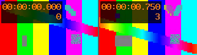

# Reference Packages

These packages are authored fixtures for `0.1.0-draft.1`. The source is generated
test imagery with a generated tone, not camera footage. No Unity project, scene,
position, or capture component is involved.

| Package | Contents | Expected Core Checker Result |
| --- | --- | --- |
| [minimal](minimal/manifest.json) | Original MP4, video and audio stream records, no summaries | First five levels pass |
| [summary](summary/manifest.json) | Same MP4, selected video frames, audio range, annotations, coverage, sheet and text | First five levels pass |
| [linked](linked/manifest.json) | Source identity retained, source bytes deliberately omitted | Integrity unavailable; metadata and text checks pass |

All three report general source resolution and derivative reproduction as
`not_checked`. Passing metadata checks does not mean the media has been decoded.

## Inspect

The [source MP4](summary/media/source.mp4) has four 160x90 H.264 frames, at 4 fps,
and a mono 48 kHz AAC track. Its one-second presentation span is `[0,1)`. Video
PTS values in decoded presentation order are `0,4096,8192,12288`, with time base
`1/16384`. The first and last frames have normalized times `0/1` and `3/4`.
The stream includes B-frames, so packet order is not the frame-locator convention.



The [791-byte text projection](summary/text/overview.txt) declares the layout,
source sample IDs, timing, missing activity analysis, and color/audio limitations.
The maximum selected timestamp gap is `3/4` second; no event-detection guarantee
is made. The timestamps visible inside the generated source pattern are source
pixels, not an added ROAMV metadata channel.

The source is 17,320 bytes with SHA-256:

```text
93fdfaef97e2be3d097bb62eb4bc3b183f0f750cc05c977d872c5c694ad6d8d7
```

All asset lengths and hashes are in their manifests. The same source bytes are
embedded in `minimal` and `summary`; `linked` retains that identity without bytes.
An unavailability reason is not a fake URI or a zero-filled source file.

## Verify the Fixture Media

From the parent `roamv` directory, with its Python dependency installed:

```bash
python3 -B -m unittest discover -s tests -v
python3 -B tests/verify_reference_media.py -v
```

The second command additionally requires FFmpeg and ffprobe. It checks stream
metadata, decoded presentation locators, audio range availability after priming
skip, exact RGB equality of source frames and previews, and every sheet pixel
including its two-pixel separator. It is specific to this fixture, not a decoder
for arbitrary packages, and does not change the general checker's reported levels.

These checks passed with FFmpeg/ffprobe `6.1.1-3ubuntu5` on 2026-09-10: 26 core
test methods, including table-driven invalid cases, and four media checks. Core
tests additionally exercise audio-only and untimed image-only metadata, large
timestamps, repeated PTS, uncertainty, corrupt files, and unknown extensions.
All 30 checks also passed after copying the standalone draft directory outside
the repository, with only its declared Python dependency and the media tools.

## Reproduce the Media

The following commands generate media in a new temporary directory, leaving the
shipped fixtures untouched. They use the source, extraction, and rendering
parameters recorded in the summary manifest. They are examples to inspect and
run deliberately, not executable instructions that a package reader should trust.

```bash
work=$(mktemp -d)
cd "$work"
mkdir media images

ffmpeg -v error -nostdin \
  -f lavfi -i testsrc2=size=160x90:rate=4:duration=1 \
  -f lavfi -i sine=frequency=440:sample_rate=48000:duration=1 \
  -map 0:v -map 1:a -c:v libx264 -pix_fmt yuv420p \
  -preset medium -threads:v 1 -g 4 -bf 2 \
  -x264-params b-adapt=0:scenecut=0 -c:a aac -b:a 64k \
  -t 1 -movflags +faststart -map_metadata -1 media/source.mp4

ffmpeg -v error -nostdin -i media/source.mp4 -map 0:v:0 \
  -vf 'select=eq(n\,0)+eq(n\,3),format=rgb24' \
  -fps_mode passthrough -threads:v 1 images/frame-%d.png

ffmpeg -v error -nostdin \
  -i images/frame-1.png -i images/frame-2.png \
  -filter_complex '[0:v][1:v]xstack=inputs=2:layout=0_0|162_0:fill=0x5a5a60,format=rgb24' \
  -frames:v 1 -threads:v 1 images/overview.png
```

Builds, codec libraries, and decoder defaults can change encoded bytes or pixels.
Regenerated media is not assumed byte-identical: compare it, and update hashes,
recorded processing details, and revision if making a new package. Text is
generated from the authoritative records using `check.sheet_text`; its asset
hash is computed after rendering, with no self-hash inside the text.
